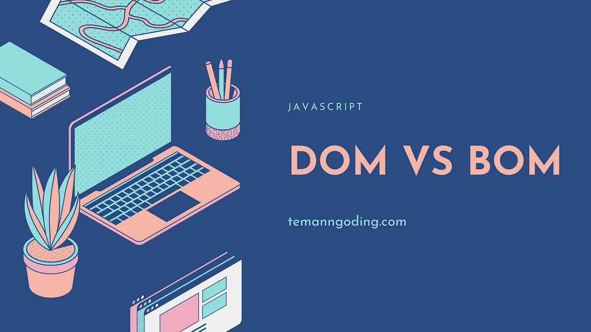

<!-- Project logo -->
<div align ='center'>
    <a href = 'https://tp5ej1elopez.netlify.app/'>
    
    </a>
    <h1>Trabajo Practico N° 5</h1>
    <p>
    Ej N°1
    </p>
    <br>
    <a href = 'https://tp5ej1elopez.netlify.app/'>
    <strong>Explorar página</strong>
    </a>
    <br>
    <a href = 'https://tp5ej1elopez.netlify.app/'>
    Solicitar una mejora
    </a>
    .
    <a href = 'https://tp5ej1elopez.netlify.app/'>
    Soporte
    </a>
    <br><br>
</div>

## Tablas de contenido

- [💻 Sobre TP](#💻-sobre-nexus)
- [⚒️ Tecnologías](#⚒️tecnologias)
- [✅ Requisitos](#✅-requisitos)
- [💿 Instalación](#💿-instalación)
- [🤝 Como contribuir](#🤝-como-contribuir)
- [👨‍💻👩‍💻 Autores](#👨‍💻👩‍💻autores)
- [📞 Contactos](#📞-contactos)
- [📄 Licencia](#📄-licencia)

## 💻 Trabajo Practico N°5:


Readme del trabajo práctico número 5 de DOM y BOM

## ⚒️Tecnologias

| Tecnología         | Versión |
| ------------------ | ------- |
| ![HTML-badge]      | 5       |
| ![CSS-badge]       | 3       |
| ![Bootstrap-badge] | 4.3     |
| ![GitHub-badge]    | -       |
| ![Trello-badge]    | -       |

## ✅ Requisitos

- Windows 10
- GIT
- Visual Code
- Extension "live server" para visual code

> [!IMPORTANT]
> ¡Atención! Para que la página funcione correctamente, es imprescindible cumplir con todos los requisitos mencionados anteriormente.

## 💿 Instalación

- Clonar repositorio:

```bash
git clone https://github.com/elopezgit/tp5elopez.git
```


## 🤝 Como contribuir

Para contibuir, por favo seguir los siguientes pasos:

1. Hacer un fork del respositorio y clonarlo
2. Crear desde la rama `dev` una nueva rama para comenzar `git checkout -b "nueva-rama"`
3. Realizar los cambios y subirlos a su fork `git push origin nueva-rama`
4. Solicitar un pull request a la rama `dev` del repositorio original.

## 👨‍💻👩‍💻Autores

_Esteban Alejandro López_

- github: elopezgit

## 📞 Contactos

| Medio    | Link                                                    |
| -------- | ------------------------------------------------------- |
| Email    | [lopezestebanalejandro@gmail.com](mailto:lopezestebanalejandro@gmail.com)               |


## 📄 Licencia

Codigo y documentación copyright 2023-2024. Distribuido bajo la licencia MIT. Consulte el archivo LICENSE.md para obtener mas informacion.

<!-- Markdown links & images -->

[HTML-badge]: https://img.shields.io/badge/HTML5-E34F26?style=for-the-badge&logo=html5&logoColor=white
[CSS-badge]: https://img.shields.io/badge/CSS3-1572B6?style=for-the-badge&logo=css3&logoColor=white
[Bootstrap-badge]: https://img.shields.io/badge/Bootstrap-563D7C?style=for-the-badge&logo=bootstrap&logoColor=white
[GitHub-badge]: https://img.shields.io/badge/GitHub-181717?style=for-the-badge&logo=github&logoColor=white
[Trello-badge]: https://img.shields.io/badge/Trello-0079BF?style=for-the-badge&logo=trello&logoColor=white
